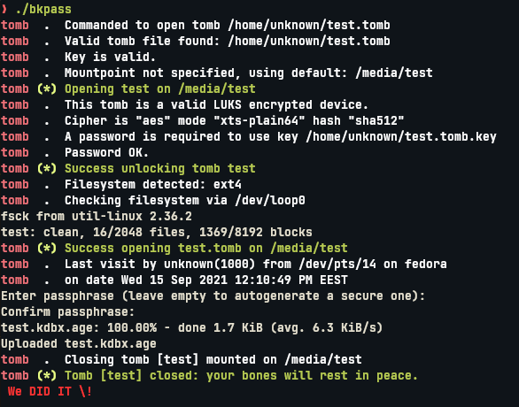

```
 _      _
| |__  | | ___ __    __ _  ___  ___
| '_ \ | |/ / '_ \  / _` |/ __|/ __|
| |_) ||   <| |_) || (_| |\__ \\__ \
|_.__/ |_|\_\ .__/  \__,_||___/|___/
            |_|
	
I don't trust mega.nz and just want enhance security of keepassxc database
```

## Introduction
Just a shell script, that encrypt database from your password-manager and upload it to mega.nz
!!! Now only for .kdbx !!!

 Requirements:
------------------------------------------------
- [megatools](https://megatools.megous.com/)
- [age](https://github.com/FiloSottile/age) / [rage](https://github.com/str4d/rage) or gnupg (gpg) for the safe storage of password database
- [tomb](https://github.com/dyne/Tomb) or [veracrypt-console](https://github.com/veracrypt/VeraCrypt) this is needed for the encrypted storage, because the .megarc dotfile (megatools config) contains your password in PLAIN TEXT from mega.nz. Script automate mounting and unmounting encrypted storage, we need .megarc only when doing backup

### Install requirements
<table>
    <tr>
        <td>Fedora 33+</td>
        <td>
            <code>dnf install age megatools</code>
        </td>
    </tr>
    <tr>
        <td>Ubuntu 21.04+ / Debian 11+</td>
        <td>
            <code>apt install megatools age</code>
        </td>
    </tr>
    <tr>
        <td>Arch Linux (AUR)</td>
        <td>
            <code>pacman -S age megatools # You can install veracrypt with yay</code>
        </td>
    </tr>
</table>
> You can install VeraCrypt with binary from official site [https://veracrypt.fr/](https://veracrypt.fr/) (Fedora[use .rpm for CentOS]/Ubuntu/Debian/OpenSUSE/FreeBSD/MacOS/Windows)
> 
> For tomb just follow official guide in repo [https://github.com/dyne/Tomb](https://github.com/dyne/Tomb)

## Usage
1. You must create tomb.key and .tomb storage file (follow the instructions in tomb repo [wiki](https://github.com/dyne/Tomb/blob/master/INSTALL.md))
2. You need to create a dotfile .megarc in home directory, with this parameters
```
[Login]
Username = test@hello.com
Password = verystrongpassword123
```

> Now you know why we need encrypted storage for this dotfile.

3. Then check configuration
```
$ megals # You should see output of your filesystem from mega.nz:

/Inbox
/Root # Your default directory
/Trash
```

4. Clone git and enter to directory bkpass:
```
$ git clone https://github.com/hexchills/bkpass.git 
$ cd bkpass
```

5. Run script (works if .kdbx database in home directory):
```
$ chmod +x bkpass
$ ./bkpass 
# You may want to add script to .local/bin/ for better usability

```

* You see password promt for swapoff:
```
[sudo] password for user:
```

* Then for tomb
* And for age:
```
Enter passphrase (leave empty to autogenerate a secure one):
```

If everything went well, you should see this output:


